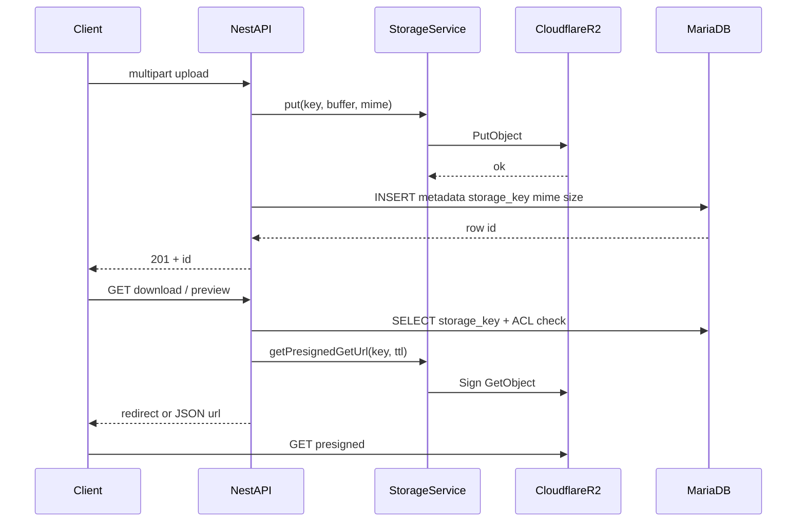
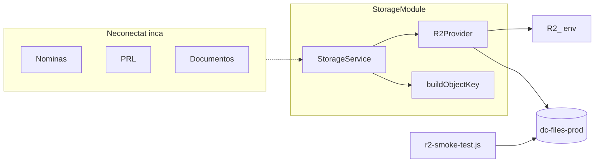

# Arhitectura Cloudflare R2 — DeCamino / HERA / ecosistem

**Status (2026-08-06):** **DeCamino + HERA — fluxuri de fișiere din app = R2-only** (LONGBLOB dropat pe modulele active). Rămâne doar legacy facturare orphan (~3.3 MB pe Decamino) + **Vecindario** semnături/poze (avatare deja pe R2).  
**Aplicații vizate:** DeCamino, HERA (același backend NestJS), Vecindario.  
**Ultima actualizare document:** 2026-08-06 (post email_attachments + inventar live).

Acest document este referința oficială pentru storage pe Cloudflare R2. Un dezvoltator nou ar trebui să poată înțelege de aici de ce există R2, cum e organizat codul, ce e deja făcut și cum se va migra fără a rupe producția.

---

## 0. Stare actuală (snapshot)

### 0.1 Ce e DONE pe R2 (DeCamino / HERA)

| Modul | Service | Backfill (Decamino / Hera) | Coloană blob |
|-------|---------|----------------------------|--------------|
| Fotos Trabajo | `StorageService` direct | n/a (nou pe R2) | — |
| Nóminas | `NominasStorageService` | 837 / 365 | `archivo` DROP |
| Diplomas | `DiplomasStorageService` | 39 / 0 | `archivo` DROP |
| Certificados retenciones | `CertificadosRetencionesStorageService` | 162 / 0 | `archivo` DROP |
| CarpetasDocumentos | `CarpetasDocumentosStorageService` | 462 / 19 | `archivo` DROP |
| DocumentosOficiales | `DocumentosOficialesStorageService` | 907 / 1 | `archivo` DROP |
| PRL (templates + employee) | `PrlDocumentsStorageService` | 32+544+150 / 0 | blob cols DROP |
| Catalogo | (catalog storage) | 52 / 53 | `fotoproducto` DROP |
| Comunicados | (comunicados storage) | 10 / 0 | `archivo` DROP |
| Avatar DeCamino | (avatar storage) | 11 / 6 | `AVATAR` DROP |
| pedidos-notas | (pedidos-notas storage) | 0 / 0 | R2 + disk dual-read |
| presupuestos / informes firmas | (firmas storage) | PDF + PNG | `pdf_content` / base64 DROP |
| Pedidos albaranes | `PedidosAlbaranesStorageService` | 91 / 0 | `archivo` DROP |
| Portal docs / facturi / insp. | `PortalDocumentsStorageService` | 2+285+0 / 0 | `archivo` DROP |
| Inspecciones + Materiales | `InspeccionesMaterialesStorageService` | 161+7 / 0 | `archivo` DROP |
| email_attachments | `EmailAttachmentsStorageService` | 280 / 14 | `file_content` DROP |
| Vecindario avatare | helper R2 + `profile_image_storage_key` | — | R2 + disk fallback |

Inventar live: `npm run` → `node scripts/inventory-remaining-blobs.js .env.decamino.local` (din `backend/`).

### 0.2 Ce mai e de făcut

| Prioritate | Item | Note |
|------------|------|------|
| **1 — următor** | **Vecindario** semnături (`signature_image`) + poze (`photo_base64` / JSON) | Avatarele sunt pe R2; restul încă LongText/JSON în `vecindario_db` |
| **2 — optional / cleanup** | Legacy `Facturas*` / `FacturasRecibidas` / `ArhivosFacturasRecibidas` | ~**3.3 MB** pe Decamino; **0** pe Hera. **Fără UI/API Nest activ** (`@@ignore` + doar `archive/frontend-old`). Export + DROP sau R2 one-shot dacă vrei zero blob |
| **3 — cleanup** | Coloane BLOB goale | **Done** (2026-08-06): DROP `Clientes.CONTRACTO`, `SignSessions.original`/`signed`, `prl_employee_documents.certificado_archivo` pe Decamino + Hera |
| **4 — ops** | `dc-backups-prod`, Synology sync, checksum audit, runbook restore, n8n | Nu blochează app-ul; infrastructură backup |
| **5 — later (notat)** | Fotos Trabajo key álbum `{id}__{slug}` (§4.3); presigned GET fără proxy HR | **Amânat.** Cosmetice/UX — **nu blochează**. Risc dacă migrare/cutover greșit: (1) keys R2 vs `storage_key` în DB; (2) TTL/CORS/auth pe URL-uri presigned. De făcut pe rând, cu dry-run. |

### 0.3 Inventar LONGBLOB rămas (2026-08-06)

**`decamino_db` — ~3.27 MB total cu date:**

| Tabel.coloană | Size | Rows | storage_key |
|---------------|------|------|-------------|
| `FacturasRecibidas.File` | 3.04 MB | 18/18 | Nu |
| `Facturas.PDF` | 0.11 MB | 5/5 | Nu |
| `Facturas.EFactura` | 0.02 MB | 5/5 | Nu |
| `ArhivosFacturasRecibidas.file` | 0.10 MB | 1/1 | Nu |

**`hera_facility_db`:** **0.00 MB** blob cu date (doar coloane goale legacy).

**Verdict:** DeCamino/HERA app files → **gata pe R2**. Restul = orphan facturare + Vecindario + ops.

---

## 1. Scopul proiectului

### 1.1 De ce Cloudflare R2

- **Object storage S3-compatible** — același SDK (`@aws-sdk/client-s3`) ca pentru AWS S3 / MinIO; fără vendor lock-in greu de migrat.
- **Fără taxă de egres** spre internet (model Cloudflare) — relevant pentru download-uri frecvente (nóminas, PDF-uri portal, poze).
- **Scalare pe volum** — dump-urile MariaDB și backup-urile nu mai trebuie să transporte GB de LONGBLOB la fiecare noapte.
- **Separare clară** — baza rămâne pentru relații și metadata; fișierele trăiesc în obiecte adresabile prin cheie.

### 1.2 Problemele istorice cu LONGBLOB în MariaDB

În DeCamino / HERA, majoritatea fișierelor **erau** stocate ca `Bytes` / `LONGBLOB`. După migrarea aug 2026, modulele active scriu/citesc pe R2; vezi **§0** pentru snapshot.

Consecințe măsurate (audit read-only, început aug 2026 — înainte de cutover):

| Bază | Ordin de mărime blob-uri (pre-migrare) | Stare post-migrare (2026-08-06) |
|------|----------------------------------------|----------------------------------|
| `decamino_db` | ~**2.3 GB** LONGBLOB | ~**3.3 MB** legacy Facturas* + coloane goale |
| `hera_facility_db` | ~**76 MB** LONGBLOB | **0 MB** cu date |
| `vecindario_db` | media mică (semnături / poze LongText/JSON + disc) | Avatare pe R2; semnături/poze **Pending** |

Probleme operaționale:

- **Backup-uri MariaDB lente și voluminoase** — fiecare `mysqldump` include PDF-uri și imagini.
- **Memorie / latență API** — upload via multer memory → INSERT blob; download citește tot rândul din DB.
- **Replicare / provisioning tenant** — DB-per-tenant (`decamino_db`, `hera_facility_db`, `tenant_*`) duplică costul de storage pe instanță.
- **Hibrid inconsistent** — unele fluxuri scriu pe disc (`uploads/presupuestos-firmas`, `pedidos-notas`, avatare Vecindario), altele în LONGBLOB / base64.
- **Duplicare** — ex. PRL `archivo_original` ≈ copie a template-ului per angajat (sute de MB).

### 1.3 Obiective pe termen lung

1. **R2 = storage principal** pentru toate fișierele aplicațiilor.
2. **MariaDB = metadata** (`storage_key`, `mime`, `size`, `checksum`, nume afișat) — fără conținut binar.
3. **Același `StorageService`** pentru DeCamino, HERA și (ulterior) Vecindario.
4. **Backup:** dump-uri DB + copii obiecte; **Synology = backup permanent**; R2 = operațional.
5. **Zero LONGBLOB nou** în cod; eliminare treptată a coloanelor binare existente.
6. Acces la fișiere private doar prin **presigned URL** sau proxy autentificat — nu URL-uri publice permanente pe documente HR.

---

## 2. Arhitectura

### 2.1 Unde trăiește codul

Backend NestJS: `decaminoserviciosapp/backend/src/storage/`  
Config: `decaminoserviciosapp/backend/src/config/storage.config.ts`  
Modulul este importat în `AppModule` ca `StorageModule` (`@Global()`), dar **niciun modul business nu îl apelează încă**.

```text
decaminoserviciosapp/backend/src/
  storage/
    storage.module.ts          # Nest Global module
    storage.types.ts           # tipuri Put/Get/Presign/Config
    storage-provider.ts        # interface StorageProvider + token
    r2.provider.ts             # implementare Cloudflare R2
    storage.service.ts         # fațadă pentru aplicație
    object-key.util.ts         # buildObjectKey / safeFileName
  config/
    storage.config.ts          # registerAs('storage', …)
scripts/
  r2-smoke-test.js             # CLI smoke (put/exists/presign/get/delete)
```

### 2.2 Componente

#### StorageModule

- Modul Nest **global**: exportă `StorageService`, `R2Provider`, token `STORAGE_PROVIDER`.
- La boot **nu** cere R2 obligatoriu: dacă `R2_ENABLED≠true` sau lipsesc credențiale, aplicația pornește normal; apelurile la storage eșuează clar (`ServiceUnavailableException`).

#### StorageProvider (interface)

Contract abstract (swap-abil ulterior: R2 → alt S3, etc.):

| Metodă | Rol |
|--------|-----|
| `put` | Upload buffer/string |
| `get` | Download ca `Buffer` |
| `exists` | HeadObject / echivalent |
| `delete` | Ștergere obiect |
| `getPresignedGetUrl` | URL temporar citire |
| `getPresignedPutUrl` | URL temporar scriere (pregătit pentru upload direct din client, nefolosit încă) |

#### R2Provider

- Implementare S3-compatible cu `@aws-sdk/client-s3` + `@aws-sdk/s3-request-presigner`.
- Clientul S3 este **lazy** (creat la primul apel) — boot fără endpoint/chei nu crapă.
- `forcePathStyle: true`, `region` tipic `auto`, endpoint `https://{ACCOUNT_ID}.r2.cloudflarestorage.com`.

#### StorageService

- Fațadă pe care o vor injecta modulele business.
- `isEnabled()` — verifică `R2_ENABLED` + credențiale + bucket + endpoint.
- Delegă către `R2Provider`; expune și `buildObjectKey(...)`.

#### buildObjectKey

Helper pentru chei canonice (vezi §4). Sanitizează numele fișierului (`safeFileName`) și folosește UUID ca să evite coliziuni.

### 2.3 Fluxul țintă (viitor): Upload → MariaDB → R2 → Download

Astăzi fluxul real este încă **multer → LONGBLOB**. Fluxul **țintă** după migrare:



**Reguli:**

1. Auth / autorizare **întotdeauna în API** (JWT, portal, roluri) — R2 nu înlocuiește ACL.
2. MariaDB ține **cheia**, nu binărul.
3. Download: preferabil **presigned GET** pe TTL scurt; alternativ `StorageService.get()` + stream din API (pentru atașamente email etc.).

### 2.4 Diagrama componentelor (stare actuală)



---

## 3. Bucket-uri

### 3.1 Bucket-uri planificate

| Bucket | Rol | Acces |
|--------|-----|--------|
| **`dc-files-prod`** | Fișiere aplicație (PDF, imagini, albaranes, PRL, portal, etc.) | Privat; citire prin presigned / API |
| **`dc-backups-prod`** | Dump-uri MariaDB, export-uri n8n, arhive operaționale | Privat; doar job-uri backup |

Pe staging (când există): același model cu sufix `-staging` (ex. `dc-files-staging`).

**În uz acum:** `dc-files-prod` (configurat în env; smoke + test manual).  
**`dc-backups-prod`:** planificat — încă nu e obligatoriu pentru etapa de infrastructură.

Opțional ulterior: bucket public separat doar pentru asset-uri intenționat publice (logo-uri CDN). Documentele HR **nu** intră acolo.

### 3.2 De ce NU folosim bucket per client / per tenant

- Multiplică credențiale, lifecycle policies, monitoring și CORS.
- Tenancy-ul DeCamino/HERA este deja **database-per-tenant** (`decamino`, `hera`, `tenant_<slug>`); izolarea pe obiecte se face prin **prefix** `{app}/{tenant}/...`.
- Un client enterprise care cere bucket dedicat poate primi override pe `storage_bucket` în metadata — fără a schimba modelul default.
- Limite operaționale Cloudflare / complexitate IaC cresc inutil cu zeci/sute de bucket-uri.

### 3.3 Directoare virtuale (prefixe)

R2 nu are foldere reale; „folderele” sunt prefixe în cheie:

```text
dc-files-prod/
  decamino/
    decamino/          ← tenant slug (DB decamino_db)
      nominas/...
      prl/...
      docs-oficiales/...
    hera/              ← tenant slug (DB hera_facility_db)
      nominas/...
    _smoke/            ← teste automate (șterse după smoke)
    _manual-test/      ← teste manuale vizibile
  vecindario/          ← ulterior
    {companyId}/...
```

Backup-uri (bucket separat):

```text
dc-backups-prod/
  prod/mariadb/{app}/{tenant}/YYYY/MM/DD/...
  prod/n8n/{instance}/YYYY/MM/DD/...
```

---

## 4. Structura cheilor

### 4.1 Pattern canonic

```text
{app}/{tenant}/{domain}/{scope_id}/{yyyy}/{mm}/{uuid}__{safeName}.{ext}
```

| Segment | Semnificație |
|---------|----------------|
| `app` | `decamino` (acoperă și white-label HERA pe același codebase) sau `vecindario` |
| `tenant` | Slug registry (`decamino`, `hera`, `tenant_acme`) sau `companyId` la Vecindario |
| `domain` | Tip logic: `nominas`, `prl`, `docs-oficiales`, `carpetas`, `clientes`, … |
| `scope_id` | ID angajat / client / pedido / community — unitatea de ACL |
| `yyyy` / `mm` | Data upload (UTC) — ușurează lifecycle și audit |
| `uuid` | Identificator unic al obiectului |
| `safeName.ext` | Nume original sanitizat + extensie |

Implementare: `object-key.util.ts` → `buildObjectKey()` / `safeFileName()`.

### 4.2 Exemple reale

**Nóminas**

```text
decamino/decamino/nominas/emp_1842/2026/03/a1b2c3d4-…__nomina-marzo.pdf
decamino/hera/nominas/emp_0091/2026/03/e5f6…__nomina-marzo.pdf
```

**Diplomas**

```text
decamino/decamino/diplomas/{empleadoId}/2026/01/{uuid}__diploma-….pdf
```

**Certificados de retenciones**

```text
decamino/decamino/certificados-retenciones/{empleadoId}/2026/04/{uuid}__retenciones-….pdf
```

**PRL**

```text
decamino/decamino/prl/templates/Limpiador/2026/01/…__manual-prl.pdf
decamino/decamino/prl/employees/emp_1842/original/2026/02/…__manual-prl.pdf
decamino/decamino/prl/employees/emp_1842/firmado/2026/02/…__manual-firmado.pdf
```

**Documentos (oficiales / carpetas)**

```text
decamino/decamino/docs-oficiales/emp_1842/2026/05/…__contrato.pdf
decamino/decamino/carpetas/emp_1842/2026/05/…__dni-anverso.jpg
```

**Clientes / portal**

```text
decamino/decamino/clientes/cli_55/contratos/2026/04/…__contrato-mantenimiento.pdf
decamino/decamino/portal/facturas/cli_55/2026/04/…__factura-042026.pdf
decamino/decamino/portal/general/2026/01/…__politica-privacidad.pdf
```

**Pedidos**

```text
decamino/{tenant}/pedidos-albaranes/{pedidoUid}/2026/08/…__albaran.pdf
decamino/{tenant}/pedidos-notas/{notaId}/2026/08/…__foto.jpg
```

**Inspecciones / materiales**

```text
decamino/{tenant}/inspecciones-materiales/inspecciones/{inspeccionId}/2026/01/…__ENTR-….pdf
decamino/{tenant}/inspecciones-materiales/materiales/{inspeccionId}/2026/01/…__albaran.jpeg
```

**Email attachments (sent-emails)**

```text
decamino/{tenant}/email-attachments/{emailId}/2025/12/…__Ficha_….pdf
```

**Fotos Trabajo (modul activ — R2)**

Stare actuală (v1):

```text
decamino/{tenant}/fotos-trabajo/{clienteId}/{albumId}/{yyyy}/{mm}/{uuid}__{safeName}.ext
```

Exemplu în bucket: `…/fotos-trabajo/99/1/…`, `…/fotos-trabajo/99/2/…` (ID-uri).

### 4.3 Decizie: nume lizibile pe segmentul de serviciu / álbum (Fotos Trabajo)

**Context (aug 2026):** pe Synology / Cloudflare UI, folderele de album apar ca `1/`, `2/` — greu de recunoscut față de frontend (`CRISTAL PADEL ROTO - 13.07.2026`). Clientul pe ID rămâne corect.

**Decizie de migrare / evoluție keys (de implementat):**

| Segment | Convenție | Motiv |
|---------|-----------|--------|
| Client / comunitate | **doar `{clienteId}`** | Stabil, fără rename, fără caractere speciale |
| Serviciu / álbum | **hibrid `{albumId}__{slugTitulo}`** | Lizibil pe NAS/R2 ca în UI; ID evită coliziuni și rename-uri |
| Fișier | `{uuid}__{safeName}.{ext}` | Neschimbat |

Exemplu țintă:

```text
decamino/decamino/fotos-trabajo/99/2__cristal-padel-roto-13-07-2026/2026/07/{uuid}__foto.jpg
```

Reguli:

1. `slugTitulo` = titlu album sanitizat (lowercase, fără `/`, spații → `-`, max lungime rezonabilă).
2. La **rename** album în app: metadata DB se actualizează; obiectele R2 pot rămâne pe cheia veche (sursă de adevăr = `storage_key` în DB) — **nu** e obligatoriu rename pe R2.
3. Obiectele deja urcate pe `{albumId}` pur rămân valide; schimbarea se aplică la **upload-uri noi** (opțional backfill / rewrite ulterior).
4. Import Synology (folder/ZIP) folosește aceeași convenție când se aliniază keys.

**Status:** **Amânat / notat pentru altă dată** (2026-08-06). Nu blochează producția. La implementare: upload-uri noi pe format hibrid + opțional backfill; verificare că `storage_key` din DB rămâne sursa de adevăr. Risc principal = cutover fără aliniere keys↔DB.

**Vecindario (avatars — implementat în `vecindario-app/server`)**

```text
vecindario/{companyId}/users/{userId}/avatar/2026/08/…__avatar.jpg
vecindario/{companyId}/communities/{communityId}/parcels/{parcelId}/2026/08/…__firma.png
vecindario/{companyId}/communities/{communityId}/services/{reqId}/2026/08/…__foto1.jpg
```

Avatare: client minim R2 (`lib/r2-storage.ts`), coloană `profile_image_storage_key`, proxy GET `/api/uploads/avatars/:file`, fallback disc dacă `R2_ENABLED` nu e `true`. Backfill: `npm run storage:avatar-backfill` din `vecindario-app/server`.
---

## 5. Configurația R2

Variabile de mediu (documentate în `backend/.env.example`). **Nu** pune valori reale în git / în acest document.

| Variabilă | Rol |
|-----------|-----|
| `R2_ENABLED` | `true` activează apelurile `StorageService`; altfel `false` (default) — app pornește, storage refuză apelurile |
| `R2_ACCOUNT_ID` | Account ID Cloudflare (folosit și la construirea endpoint-ului dacă `R2_ENDPOINT` lipsește) |
| `R2_ACCESS_KEY_ID` | Access Key ID al token-ului R2 (API Token S3) |
| `R2_SECRET_ACCESS_KEY` | Secret al token-ului — **doar în env**, niciodată în cod |
| `R2_BUCKET` | Bucket implicit pentru fișiere app (ex. `dc-files-prod`) |
| `R2_ENDPOINT` | URL S3 API, tipic `https://<ACCOUNT_ID>.r2.cloudflarestorage.com` |
| `R2_REGION` | De obicei `auto` |
| `R2_PUBLIC_BASE_URL` | Opțional; bază URL publică dacă există bucket/domeniu public (nefolosit pentru docs private) |

Fișiere locale tipice (nu commitate): `.env.decamino.local`, `.env.hera.local`, `.env.client2.local`.

Config Nest: `registerAs('storage', …)` în `storage.config.ts`, încărcat din `ConfigModule`.

---

## 6. Ce este deja implementat

### 6.1 Cod

| Element | Stare |
|---------|--------|
| `StorageModule` (global) | Da — în `AppModule` |
| `StorageProvider` interface | Da |
| `R2Provider` | Da — put/get/exists/delete/presign GET & PUT |
| `StorageService` | Da — fațadă + `isEnabled()` + `buildObjectKey` |
| `buildObjectKey` / `safeFileName` | Da |
| `storage.config.ts` + `.env.example` | Da |
| Dependențe `@aws-sdk/client-s3`, `@aws-sdk/s3-request-presigner` | Da |
| CLI `npm run storage:r2-smoke` | Da |
| Endpoint HTTP intern de smoke | **Nu** (amânat intenționat) |

### 6.2 Integrare backend

- DeCamino și HERA împart același codebase Nest; ambele pot citi `R2_*` din env-ul lor.
- **Fotos Trabajo** folosește `StorageService` (put / get / delete / presign).
- **Nóminas** (R2-only): `NominasStorageService`; write/read doar pe R2; backfill Decamino 837 + Hera 365; **`archivo` DROP** (aug 2026, anticipat față de ținta sep).
- **Diplomas** (R2-only): `DiplomasStorageService`; write/read doar pe R2; backfill DeCamino 39; **`archivo` DROP** (aug 2026).
- **Certificados de retenciones** (R2-only): `CertificadosRetencionesStorageService`; write/read doar pe R2; backfill DeCamino 162; **`archivo` DROP** (aug 2026).
- **CarpetasDocumentos** (R2-only): `CarpetasDocumentosStorageService`; write/read doar pe R2; backfill Decamino 462 + Hera 19; **`archivo` DROP** (aug 2026).
- **DocumentosOficiales** (R2-only): `DocumentosOficialesStorageService`; write/read doar pe R2; backfill Decamino 907 + Hera 1; **`archivo` DROP** (aug 2026).
- **PRL** (R2-only): `PrlDocumentsStorageService`; templates + employee original/firmado pe R2; backfill Decamino 32 templates + 544 originals + 150 firmados (Hera 0); **`archivo` / `archivo_original` / `archivo_firmado` DROP** (aug 2026).
- **Etapa 2 (aug 2026):** Catalogo (`fotoproducto` DROP), Comunicados (`archivo` DROP), Avatar DeCamino (`AVATAR` DROP), pedidos-notas (R2 + disk dual-read), presupuestos-firmas (`pdf_content` DROP), informes-firmas (R2), Vecindario avatare (R2 + disk fallback).
- **Pedidos albaranes** (aug 2026): `PedidosAlbaranesStorageService`; R2-only; backfill Decamino **91** (Hera 0); **`archivo` DROP**.
- **Portal docs** (aug 2026): `PortalDocumentsStorageService`; R2-only pe `portal_documentos_generales` (2), `cliente_facturas_manuales` (285), `cliente_inspeccion_documentos` (0); Hera 0; **`archivo` DROP**.
- **Inspecciones / materiales** (aug 2026): `InspeccionesMaterialesStorageService`; R2-only pe `InspeccionesDocumentos` (Decamino **161**; Hera 0) + `MaterialesDocumentos` (Decamino **7**; Hera 0); **`archivo` DROP**. `storage_key` rămâne NULLABLE pe inspecciones (solicitudes fără PDF); pe materiales `storage_key` NOT NULL.
- **email_attachments** (aug 2026): `EmailAttachmentsStorageService` (în `StorageModule`); R2-only; backfill Decamino **280** + Hera **14**; **`file_content` DROP**; `storage_key` NOT NULL.
- Legacy `Facturas*` / `FacturasRecibidas` / `ArhivosFacturasRecibidas` — date orphan (~3.3 MB Decamino); fără Nest activ (`@@ignore`).

### 6.3 Teste efectuate (fără expunere de secrete)

| Test | Rezultat |
|------|----------|
| `npm run storage:r2-smoke` (decamino env) | **SUCCESS** — put → exists → presign GET → get → delete |
| `npm run storage:r2-smoke -- .env.hera.local` | **SUCCESS** (aceeași secvență) |
| Upload manual vizibil | **OK** — obiect lăsat în bucket pentru verificare în UI Cloudflare |
| Manual key | `decamino/_manual-test/2026/08/test-r2.png` (image/png, ~70 bytes) pe `dc-files-prod` |
| Nest `build` cu StorageModule | **OK** — boot posibil cu R2 disabled |

Smoke șterge obiectul de test automat. Testul manual **nu** șterge până la confirmare explicită.

---

## 7. Ce NU este implementat încă

Vezi și **§0.2** (priorități).

**App / date:**
- **Vecindario:** semnături (`signature_image`) + photos (`photo_base64` / JSON) — avatarele sunt pe R2.
- **Legacy Facturas\*** (opțional): `FacturasRecibidas.File`, `Facturas.PDF` / `EFactura`, `ArhivosFacturasRecibidas.file` — fără UI/API activ; cleanup sau one-shot R2.
- Coloane BLOB goale — **Done** (DROP `Clientes.CONTRACTO`, `SignSessions.original`/`signed`, `prl_employee_documents.certificado_archivo`).

**Ops / platformă:**
- Lifecycle pe prefixe / bucket `dc-backups-prod` automatizat.
- Sync / retenție Synology + runbook restore.
- Checksum audit / perioadă coexistență formală.
- Endpoint HTTP `/api/internal/storage/r2-smoke`.
- Frontend HR fără proxy (presigned) pentru nóminas/PRL — **Deferred** (notat); TTL scurt + CORS + auth înainte de emitere URL.
- Fotos Trabajo: segment álbum `{albumId}__{slugTitulo}` (§4.3) — **Deferred** (notat).
- n8n redirect total către R2.

---

## 8. Planul de migrare

Ordinea optimizează **risc × complexitate × impact pe backup**, nu doar „ce e mai mare”.

### Etapa 0 — Infrastructură (DONE)

StorageModule, env, smoke, documentație.

### Etapa 1 — Funcționalitate nouă direct pe R2

Orice **feature nou** care salvează fișiere folosește doar `StorageService` + metadata în DB.  
**De ce:** oprește creșterea LONGBLOB; validează abstracția pe fluxuri mici, fără date istorice.

**Done:** Fotos Trabajo; **Nóminas** (R2-only, `archivo` dropped); **Diplomas** (R2-only, `archivo` dropped); **Certificados de retenciones** (R2-only, `archivo` dropped); **CarpetasDocumentos** (R2-only, `archivo` dropped); **DocumentosOficiales** (R2-only, `archivo` dropped); **PRL** (R2-only, blob columns dropped).

### Etapa 2 — Fișiere mici / disk deja hibrid

**Done (aug 2026):**
- Catalog `fotoproducto` — R2-only; `fotoproducto` DROP (Decamino 52 + Hera 53)
- **Comunicados** — R2-only; `archivo` DROP (Decamino 10; Hera 0)
- **Avatare DeCamino** — R2-only; `Avatar.AVATAR` DROP (Decamino 11 + Hera 6)
- **pedidos-notas** — write/read R2 (+ disk dual-read); 0 imagini de backfillat pe ambele DB
- **presupuestos-firmas** — R2; `pdf_content` DROP; **`firma_imagen_base64` DROP** (Decamino 1 PNG pe R2); `firma_imagen_storage_key`
- **informes-firmas** — R2 write/read; **`firma_imagen_base64` DROP** (0 rows); `firma_imagen_storage_key`
- **Vecindario avatare** — R2 helper + `profile_image_storage_key` + proxy GET; disk fallback dacă R2 off

**Pending în Etapa 2 / ulterior:** Vecindario semnături + photos JSON.

**De ce:** volume mai mici sau deja pe filesystem; cutover ușor de verificat vizual; impact HR redus.

### Etapa 3 — Documentos / PRL / Carpetas

- `DocumentosOficiales`, `CarpetasDocumentos` — **Done** (aug 2026)
- PRL templates + employee docs — **Done** (aug 2026; de-duplicare `archivo_original`↔template lăsată opțională)
- Inspecciones / materiales — **Done** (aug 2026; R2 + DROP `archivo`; solicitudes fără PDF păstrează `storage_key` NULL)  

**De ce:** cel mai mare volum pe `decamino_db`, dar module relativ izolate; necesită email-ingestion + portal PDF.

### Etapa 4 — Nóminas: DROP coloană `archivo`

**Stare (2026-08-06):** **Done** — DROP pe Decamino + Hera; Prisma + upload/download R2-only (anticipat față de ținta ≥ 2026-09-06).

Checklist îndeplinit:
1. 0 rânduri cu `archivo IS NOT NULL` și fără `storage_key` (837 + 365).
2. `ALTER TABLE Nominas DROP COLUMN archivo` + `storage_key` NOT NULL.
3. Update `schema.prisma` + gestoria / nominas / finiquito ingestion.

### Etapa 5 — Restul + eliminarea LONGBLOB

**Stare DeCamino/HERA app (2026-08-06):** **Done** pentru fluxurile active.

- **Pedidos albaranes** — **Done**
- **Portal facturi / docs / inspecciones MVP** — **Done**
- **InspeccionesDocumentos / MaterialesDocumentos** — **Done**
- **email_attachments** — **Done**
- DROP coloane BLOB goale — **Done** (CONTRACTO, SignSessions blobs, certificado_archivo)
- **Legacy Facturas\*** — **Pending opțional** (orphan; ~3.3 MB; fără Nest)
- **Vecindario semnături + photos** — **Pending** (următorul focus app)
- vacuum / OPTIMIZE TABLE — **Pending cleanup**
- Backup-uri MariaDB „slabe” + Synology — **Pending ops**

**De ce cea mai sigură ordine:**  
1) nu migrezi totul odată;  
2) înveți pe volume mici;  
3) HR sensibil (nóminas/PRL) după ce exists/presign/delete și fallback sunt dovedite;  
4) drop LONGBLOB doar când checksum-urile și perioada de coexistență sunt OK.

---

## 9. Compatibilitate în timpul migrării

### 9.1 Model dual (recomandat)

Pe fiecare tabel migrat, metadata nouă (nume illustrative):

| Coloană | Rol |
|---------|-----|
| `archivo` / `…_base64` | legacy (nullable după backfill) |
| `storage_key` | cheie R2 |
| `storage_bucket` | opțional override |
| `mime_type` / `tamano_bytes` / `checksum_sha256` | metadata |

### 9.2 Strategie de citire (fallback)

```text
if storage_key present and R2 enabled:
    serve from R2 (presign or get)
else if legacy blob / disk path present:
    serve from MariaDB / disk
else:
    404
```

### 9.3 Strategie de scriere

```text
if feature flag USE_R2_WRITE for module:
    write R2 + metadata; leave legacy NULL (sau backfill async)
else:
    write legacy only
```

### 9.4 Cutover pe modul

1. Backfill batch (citire blob → put R2 → set `storage_key` + checksum).  
2. Activează dual-read.  
3. Activează write-only-R2.  
4. Perioadă de observație (ex. 14–30 zile).  
5. NULL pe coloana LONGBLOB → ALTER DROP (etapa finală, cu backup).

Ștergerea unui rând trebuie să șteargă și obiectul R2 (sau marchează orphan GC pe prefix) ca să nu rămână obiecte orfane.

---

## 10. Backup

### 10.1 Backup MariaDB (astăzi / pe termen scurt)

- Dump-uri pe VPS (sau job existent) pentru `decamino_db`, `hera_facility_db`, `vecindario_db`, registry.
- Cât timp există LONGBLOB, dump-urile rămân grele — motiv principal pentru migrare.

### 10.2 Backup către R2 (`dc-backups-prod`)

Prefix propus:

```text
prod/mariadb/{app}/{tenant}/YYYY/MM/DD/HHMM__{db_name}.sql.gz
prod/n8n/{instance}/YYYY/MM/DD/HHMM__export.tar.gz
```

- Retention pe lifecycle (ex. zilnic 14 zile + săptămânal 3 luni).  
- Credențiale separate sau prefix policy pe token-ul de backup (ideal).

### 10.3 Synology (obiectiv)

| Rol | Sistem |
|-----|--------|
| **Storage principal (hot)** | Cloudflare R2 (`dc-files-prod`) |
| **Backup permanent (cold / offsite local)** | Synology |

Flux țintă:

1. Aplicația scrie în R2.  
2. Job periodic: snapshot / sync obiecte importante + dump MariaDB → R2 backups **și/sau** direct Synology.  
3. Synology păstrează retenție lungă (versiuni, ransomware-safe dacă e configurat).

R2 nu înlocuiește backup-ul offsite; Synology nu înlocuiește latency-ul R2 pentru utilizatori.

---

## 11. Reguli de dezvoltare

1. **Modulele / feature-urile noi** care salvează fișiere folosesc **doar** `StorageService` (sau `StorageProvider` injectat).  
2. **Nimeni nu mai introduce LONGBLOB / base64 în DB** în cod nou.  
3. **Toate fișierele noi** merg în R2 (când `R2_ENABLED=true` pe mediu).  
4. Acces la obiecte **doar** prin `StorageService` — nu instanția `S3Client` ad-hoc în controllers.  
5. **Niciun Access Key / Secret în cod, repo public, sau ticket-uri** — doar variabile de mediu / secrets manager.  
6. Cheile respectă `buildObjectKey` (sau echivalent documentat).  
7. Documente sensibile (nóminas, PRL, contracte, DNI): bucket privat + presigned TTL scurt + ACL în API.  
8. La delete pe entitate: delete și obiectul R2 (sau job de reconciliere orphan).  
9. Nu comite `.env.*.local` cu secrete.  
10. Teste pe prefix `_smoke/` / `_manual-test/` — nu pe date reale de producție fără plan.

---

## 12. Roadmap

Checklist până la finalizarea migrării:

| # | Etapă | Stare |
|---|--------|--------|
| 1 | StorageModule + R2Provider + StorageService + env | **Done** |
| 2 | Smoke CLI + test manual pe `dc-files-prod` | **Done** |
| 3 | Documentație oficială (acest fișier) | **Done** |
| 3b | Modul **Fotos Trabajo** (metadata DB + R2 + import folder/ZIP) | **Done** (keys v1 pe `{albumId}`) |
| 3c | Fotos Trabajo: segment álbum **`{albumId}__{slugTitulo}`** (client rămâne pe ID) — §4.3 | **Deferred** — notat pentru altă dată; risc cutover keys |
| 3d | **Nóminas etapa 1:** coloane R2 + write pe R2 când `R2_ENABLED` + dual-read (NominasService + GestoriaService) | **Done** |
| 3e | Nóminas backfill LONGBLOB → R2 (`storage:nominas-backfill`) | **Done** (Decamino 835 + Hera 365, aug 2026) |
| 3f | **Nóminas: DROP coloană `archivo`** (Prisma + SQL pe ambele DB) | **Done** (aug 2026, anticipat) |
| 3g | **Diplomas:** coloane R2 + write + dual-read + backfill | **Done** (Decamino 39; Hera 0, aug 2026) |
| 3h | **Diplomas: DROP coloană `archivo`** | **Done** (aug 2026) |
| 3i | **Certificados retenciones:** coloane R2 + write + dual-read + backfill | **Done** (Decamino 162; Hera 0, aug 2026) |
| 3j | **Certificados retenciones: DROP coloană `archivo`** | **Done** (aug 2026) |
| 3k | **CarpetasDocumentos:** coloane R2 + write + dual-read + backfill | **Done** (Decamino 462; Hera 19, aug 2026) |
| 3l | **CarpetasDocumentos: DROP coloană `archivo`** | **Done** (aug 2026) |
| 3m | **DocumentosOficiales:** coloane R2 + write + dual-read + backfill | **Done** (Decamino 907; Hera 1, aug 2026) |
| 3n | **DocumentosOficiales: DROP coloană `archivo`** | **Done** (aug 2026) |
| 3o | **PRL:** coloane R2 + write + backfill (templates + original + firmado) | **Done** (Decamino 32+544+150; Hera 0, aug 2026) |
| 3p | **PRL: DROP `archivo` / `archivo_original` / `archivo_firmado`** | **Done** (aug 2026) |
| 4 | Decizie: coloane metadata Prisma (`storage_key`, …) per tabel | **Done** (pattern pe modulele migrate) |
| 5 | Feature flag write/read pe primul modul pilor (ex. catalog / comunicados) | **Done** (R2_ENABLED; Etapa 2 complete) |
| 6 | Migrare batch + dual-read module mici / disk | **Done** (catalog, comunicados, avatar, pedidos-notas, firmas PDF; aug 2026) |
| 7 | Migrare Documentos + Carpetas + email-ingestion | **Done** (Documentos + Carpetas; email-ingestion wired pe storage) |
| 8 | Migrare PRL (cu de-duplicare template opțională) | **Done** (aug 2026; de-dupe opțională rămâne) |
| 9 | Nóminas cutover final (observatie + DROP `archivo` = item 3f) | **Done** (aug 2026) |
| 10 | Migrare Pedidos albaranes, email_attachments, portal, inspecciones | **Done** (aug 2026). Legacy Facturas* = cleanup opțional (§0.2) |
| 11 | Integrare Vecindario (avatars → signatures → photos) | **Partial** — avatars **Done**; signatures + photos **Pending** (următorul) |
| 12 | Unificare path-uri `uploads/*` pe disc → R2 | **Partial** (pedidos-notas + firmas + Vecindario avatars) |
| 13 | Bucket `dc-backups-prod` + job dump MariaDB | Pending |
| 14 | Sync / retenție Synology | Pending |
| 15 | Perioadă coexistență + checksum audit | Pending (modulele active deja R2-only) |
| 16 | Drop LONGBLOB goale + legacy Facturas* + vacuum | **Partial** — empty BLOB cols DROP Done; legacy Facturas* + vacuum Pending |
| 17 | Actualizare n8n proxy / decommission fluxuri fișier legacy | Pending |
| 18 | Runbook operațional (restore din R2 + Synology) | Pending |

---

## Anexă A — Comenzi utile

```bash
cd decaminoserviciosapp/backend

# Smoke automat (șterge obiectul de test la final)
npm run storage:r2-smoke
npm run storage:r2-smoke -- .env.hera.local

# Coloane Nominas R2 (storage_key, storage_bucket, tamano_bytes)
npm run db:migrate:nominas-r2
npm run db:migrate:nominas-r2:both

# Backfill Nominas LONGBLOB → R2
npm run storage:nominas-backfill -- --dry-run
npm run storage:nominas-backfill -- --limit=50
npm run storage:nominas-backfill:both
npm run db:migrate:nominas-drop-archivo:both

# Diplomas R2
npm run db:migrate:diplomas-r2:both
npm run storage:diplomas-backfill -- --dry-run
npm run storage:diplomas-backfill:both

# Certificados de retenciones R2
npm run db:migrate:certificados-retenciones-r2:both
npm run storage:certificados-retenciones-backfill -- --dry-run
npm run storage:certificados-retenciones-backfill:both
npm run db:migrate:certificados-retenciones-drop-archivo:both

# CarpetasDocumentos R2
npm run db:migrate:carpetas-documentos-r2:both
npm run storage:carpetas-documentos-backfill -- --dry-run
npm run storage:carpetas-documentos-backfill:both
npm run db:migrate:carpetas-documentos-drop-archivo:both

# DocumentosOficiales R2
npm run db:migrate:documentos-oficiales-r2:both
npm run storage:documentos-oficiales-backfill -- --dry-run
npm run storage:documentos-oficiales-backfill:both
npm run db:migrate:documentos-oficiales-drop-archivo:both

# PRL R2
npm run db:migrate:prl-r2:both
npm run storage:prl-backfill -- --dry-run
npm run storage:prl-backfill:both
npm run db:migrate:prl-drop-archivo:both

# Etapa 2 — catalog / comunicados / avatar / pedidos-notas / firmas
npm run db:migrate:catalogo-r2:both && npm run storage:catalogo-backfill:both && npm run db:migrate:catalogo-drop-fotoproducto:both
npm run db:migrate:comunicados-r2:both && npm run storage:comunicados-backfill:both && npm run db:migrate:comunicados-drop-archivo:both
npm run db:migrate:avatar-r2:both && npm run storage:avatar-backfill:both && npm run db:migrate:avatar-drop-avatar:both
npm run db:migrate:pedidos-notas-r2:both && npm run storage:pedidos-notas-backfill:both
npm run db:migrate:presupuestos-firmas-r2:both && npm run storage:presupuestos-firmas-backfill:both && npm run db:migrate:presupuestos-firmas-drop-pdf-content:both
npm run db:migrate:informes-firmas-r2:both && npm run storage:informes-firmas-backfill:both

# Pedidos albaranes R2
npm run db:migrate:pedidos-albaranes-r2:both
npm run storage:pedidos-albaranes-backfill -- --dry-run
npm run storage:pedidos-albaranes-backfill:both
npm run db:migrate:pedidos-albaranes-drop-archivo:both

# Portal docs / facturi / inspecciones R2
npm run db:migrate:portal-docs-r2:both
npm run storage:portal-docs-backfill -- --dry-run
npm run storage:portal-docs-backfill:both
npm run db:migrate:portal-docs-drop-archivo:both

# InspeccionesDocumentos + MaterialesDocumentos R2
npm run db:migrate:inspecciones-materiales-r2:both
npm run storage:inspecciones-materiales-backfill -- --dry-run
npm run storage:inspecciones-materiales-backfill:both
npm run db:migrate:inspecciones-materiales-drop-archivo:both

# email_attachments R2
npm run db:migrate:email-attachments-r2:both
npm run storage:email-attachments-backfill -- --dry-run
npm run storage:email-attachments-backfill:both
npm run db:migrate:email-attachments-drop-file-content:both

# Cleanup coloane BLOB goale (CONTRACTO, SignSessions, certificado_archivo)
npm run db:migrate:drop-empty-blob-columns:both
```

Pentru write pe R2: `R2_ENABLED=true` (+ credențiale R2). Fără flag separat per modul.
## Anexă B — Inventar fișiere

- Script: `decaminoserviciosapp/backend/scripts/inventory-remaining-blobs.js`
- Snapshot cantitativ post-migrare: **§0.3** (2026-08-06).
- Inventarul pre-migrare (aug 2026) a identificat top consumers: `DocumentosOficiales`, `CarpetasDocumentos`, PRL, `Nominas`, etc. — toate mutate pe R2 cu DROP.

## Anexă C — Glossar

| Termen | Sens |
|--------|------|
| Tenant | Unitate SaaS / white-label ≈ o bază MariaDB (`decamino`, `hera`, …) |
| Domain (în key) | Tip de fișier logic (`nominas`, `prl`, `email-attachments`, …) |
| Presigned URL | URL semnat temporar pentru Get/Put fără a expune Access Key clientului |
| Dual-read | Citește R2 dacă există `storage_key`, altfel legacy |
| LONGBLOB | Tip MariaDB pentru binare mari — eliminat pe modulele active DeCamino/HERA |

---

*Document menținut odată cu schimbările de infrastructură R2. La fiecare etapă: actualizează **§0**, §6, §7 și §12.*
